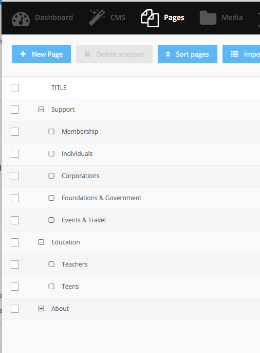
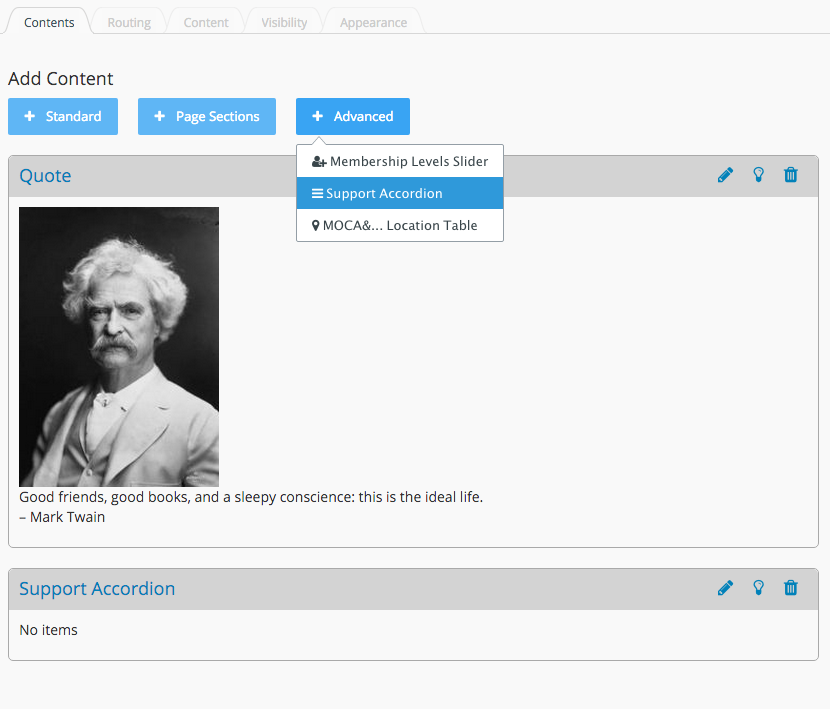
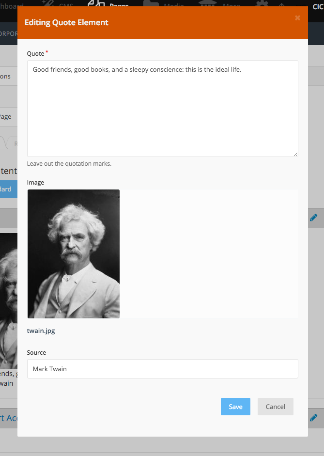

# Contentment

The _Contentment_ plugin is an alternative to Rainlab's _Static Pages_ plugin and stores page content in the database instead of on the filesystem.

## Pages

There is a `Page` record that contains some info about the page itself. From the page form, users can choose a "template" which is just a specially marked page from the CMS module (a regular CMS file-based page). Then when the CMS module renders that page, it has access to our `Page` model and can render the content as needed.

There are three types of pages: Content, Redirect and Simple. The "Type" field allows the specification of the page type. Content pages provide interfaces for content elements or various types to be added, moved around and deleted. Redirect pages will redirect a front end request from the slug URL to the specified Redirect URL. Simple pages can be configured to have additional fields specific to the page or template. 



## Contents

The `Page` model has many `Content` models that it can relate to. Each `Content` model is a polymorphic relationship to an `Element` model. The values of an `Element` are actually saved as JSON on the `Content` record. In this way, a `Page` can have many `Contents` that are different types of `Elements` without the extra database join needed to get each `Content's` `Element`.

The `Content` table looks something like this:

page_id | id | element_type | data
--- | --- | --- | ---
12 | 3 | Castiron\Contentment\Content\Elements\Text | {"body":"some body text"}

As you can see, `Elements` are actual PHP objects. And like normal October models, these `Elements` have a "fields.yaml" file that dictates how to render the form for this element. These `Elements` can also have Twig templates to render the value on the frontend as well as to render the backend preview.

To render the contents, you can call `renderContent` in your CMS Page "template":

```twig
{{ pageModel.renderContent()|raw }}
```



## Content Elements

`Elements` extend from the `Castiron\Contentment\Content\Element` base class and must be registered with the `ContentManager`. Registered `Elements` are grouped by plugin. To register, put this in your Plugin.php file:

```php
use Castiron\Contentment\Content\Manager as ContentManager;
use Me\MyPlugin\Content\Accordion;
```
```php
public function registerContentElements()
{
    ContentManager::registerElement(Accordion::class, [
      'icon' => 'icon-bars',
      'label' => 'Accordion',
      'position' => 100,
      'category' => 'Containers',
    ]);
}
```

You can use artisan scaffolding to make your elements:

```shell
php artisan create:element Me.MyPlugin Accordion
```

This will create a new `Accordion` element in a `plugins/me/myplugin/content` directory. It will also give you a default "fields.yaml" file and some templates.

Because `Elements` are extended from October's `Model` class, you can use some of the same features that are normally available in your models. For example, you can use the `Validation` trait to verify the contents of your element before it's saved. You can also listen for some events to do any adjustments as needed.

You may need to remove the elements registered by other plugins:

```
ContentManager::disableElement(SomeElement::class)
```

You may want to move other plugins' elements into a different category:

```
ContentManager::moveElement(SomeElement::class, "Some New Category");
// Or change new position as well
ContentManager::moveElement(SomeElement::class, "Some New Category", 100);
```

You may also order the categories. (Any non-positioned categories will be placed at the end in alphabetical order.)

```
ContentManager::moveCategory('Standard', 300);
ContentManager::moveCategory('Advanced', 400);
```




## Simple Pages

Similar to content elements, Simple Pages provide additional fields that appear on the page record. The Simple Page registration includes the specification of templates to which the Simple Page is compatible, as well as a name. The standard use case for Simple Page is when a page has editable areas with content that may need to vary, but which doesn't require the freedom of arbitrarily organized content elements.

Registration of a Simple Page looks like this: 

```php
        ContentManager::registerSimplePage(SampleHeaderTextImage::class, [
            'templates' => ['*'],
            'label' => 'Sample Header / Text / Image'
        ]);
```

The Simple Page class looks like this:

```php
<?php namespace Castiron\Contentment\Content\Pages;

use Castiron\Contentment\Content\Element;
use Castiron\Contentment\Content\SimplePage;

class SampleHeaderTextImage extends SimplePage {

}
```

See the example in the Contentment plugin for an example of how the associated fields are specified for the Simple Page.

Note that the options in the Simple Page selector are dynamically determined based on the selected template. If the desired Simple Page isn't appearing, it may be because the templates aren't configured properly in the registration. Also, access to the Simple Page selection field is set in user permissions. This is to prevent non-admin users from accidentally switching the Simple Page and potentially destroying the content.


## How Elements work with Twig

To render your element with Twig, you need to import the Twiggable trait:

```php
use \Castiron\Contentment\Content\Traits\Twiggable;
```

It will render "default.htm" as your frontend template and "preview.htm" as the backend preview template.

When using `Twiggable`, your `Element's` attributes are included directly as variables in the template (not accessed through any object). Also, if you need to add additional variables you can return an associative array from a function called `viewVariables`.
